# Device ports and peripherals

- [Device ports and peripherals](#device-ports-and-peripherals)
  - [Expansion Cards](#expansion-cards)
  - [Expansion Slot Types](#expansion-slot-types)
  - [Common Ports and Connectors](#common-ports-and-connectors)
    - [USB (Universal Serial Bus)](#usb-universal-serial-bus)
      - [USB Connector Types](#usb-connector-types)
    - [Other Peripheral Ports and Connectors](#other-peripheral-ports-and-connectors)
  - [Monitors](#monitors)
    - [Monitor Types](#monitor-types)
    - [Monitor Ports and Connectors](#monitor-ports-and-connectors)
  - [Standard Input Devices](#standard-input-devices)
    - [Keyboards](#keyboards)
    - [Pointing Devices](#pointing-devices)
  - [Other Common I/O Devices](#other-common-io-devices)
    - [Audio Devices](#audio-devices)
    - [Scanners](#scanners)
    - [Digital Cameras and Webcams](#digital-cameras-and-webcams)
    - [Printers](#printers)
      - [Fax Machines](#fax-machines)
    - [Multifunction Devices (MFDs)](#multifunction-devices-mfds)
    - [Exam Tip](#exam-tip)

## Expansion Cards

- Expansion cards add specific capabilities to a computer system
- They fit into expansion slots on the motherboard
- Expansion cards have a row of metal pins for slot connection
- An edge with a metal backplate fits into an opening in the PC case for port access

- **Video Card (Display Adapter)**
  - Provides ports to connect to an external display
  - Serves as a graphics processor interface
  - Important for high-performance graphics tasks

    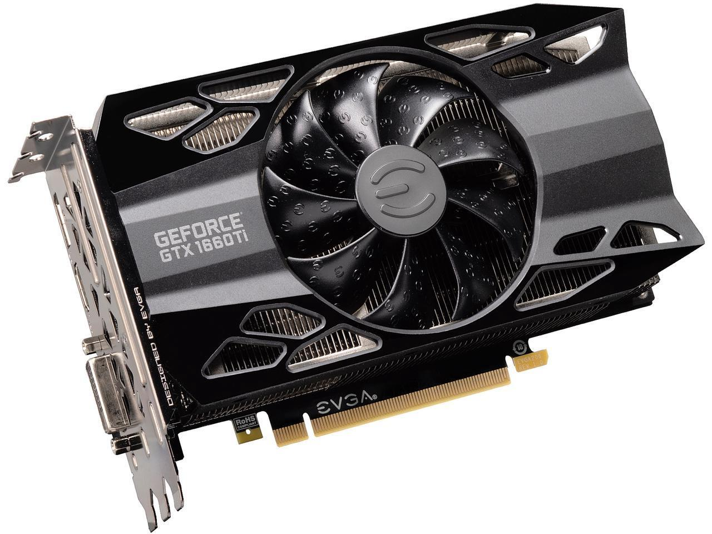

- **Audio (Sound) Card**:
  - Provides ports for audio input and output devices
    - Speakers, headphones, and microphones
  - Most sound ports are round 3.5-mm connectors

    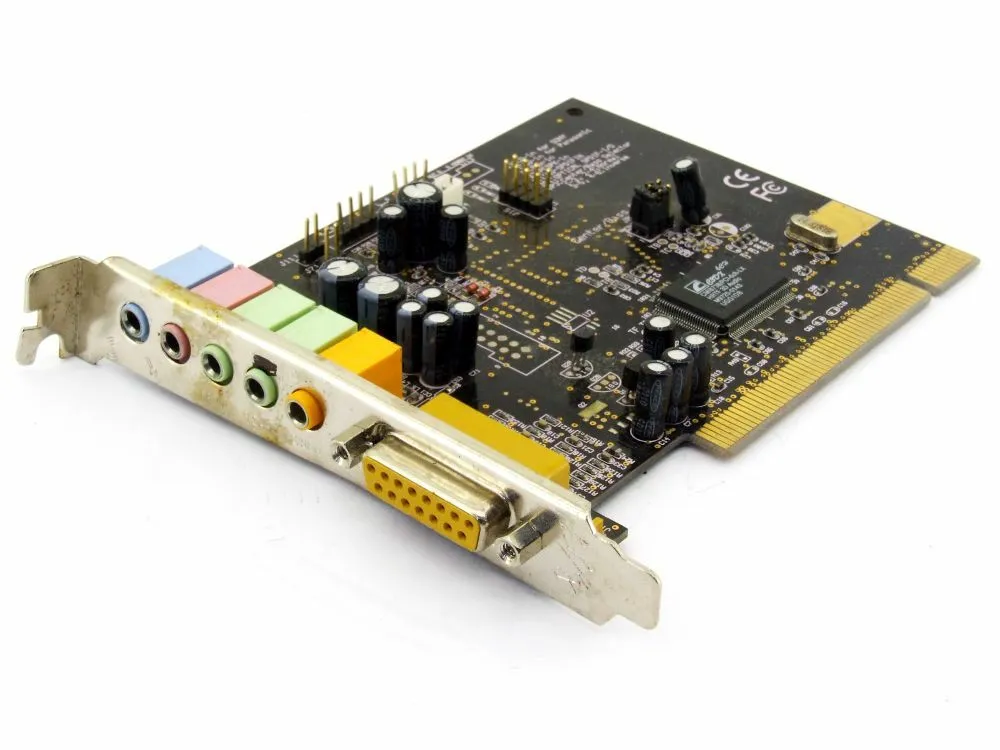

- **Network Interface Card (NIC)**:
  - Enables connection to a local area network (LAN)
  - Wired
    - Plugs into an RJ-45 port
  - Wireless
    - Has small antenna and uses 802.11 standard
  - Each NIC has a unique 48-bit hexadecimal Media Access Control (MAC) address
  - > Network adapters, whether built into the motherboard or as expansion cards, are often referred to as NICs. The term NIC refers to the functionality rather than the physical card.

    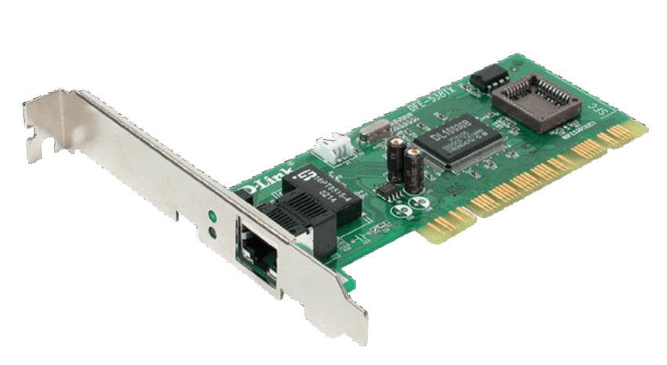

- **Modem Card**:
  - Used for dial-up Internet access via telephone landlines
  - Has two RJ-11 (telephone) ports side by side
  - The term modem is also now used to refer to:
    - High-speed cable
    - DSL Internet connectivity

    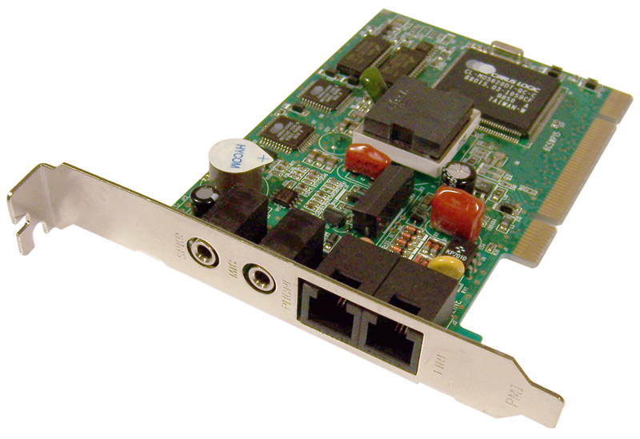

## Expansion Slot Types

- Motherboards feature different types of expansion slots to accommodate various expansion cards
- PCI Express 3.0 currently the dominant standard in the market
- The term applies to both the slot and the bus that carries data from the slot to the system bus
- Each slot has between 1 and 32 independent lanes that carry data
- Slots have a numeric designation (such as ×1, ×4, ×8, or ×16) to describe how many lanes it has
  - Lower-capacity slots (e.g., ×1):
    - Suitable for expansion cards that don't require high data throughput
    - e.g. network cards
    - Motherboards typically have several ×1 slots

  - Higher-capacity slots (e.g., ×16):
    - Designed for data-intensive expansion cards
    - e.g. video adapters
    - Motherboards typically have one or two ×16 slots
    - Some motherboards may include a PCIe ×16 slot operating at ×8 speed

- **PCI**
  - Peripheral component interconnect
  - Older general purpose slot

- **PCIe**
  - Peripheral component interconnect express
  - Faster slot for more up to date technology
  - Slots have numeric designations (e.g., ×1, ×4, ×8, ×16)
    - Differ in size and capacity
    - Indicate the number of data lanes
      - Indicate how much information is going through

- **Mini-PCIe**
  - Found in laptops for smaller versions of standard expansion cards
  - Replaced the older mini-PCI slots in newer laptop models

    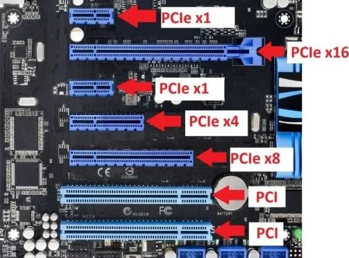

## Common Ports and Connectors

### USB (Universal Serial Bus)

- Industry-standard connector for a wide variety of peripherals
- Carries both data and power
- Used to connect and charge small electronics
- Interchangeable and backwards compatible
- **USB 2.0**:
  - Regular USB
    - Up to 1.5 Mbps (low speed) or 12 Mbps (full speed)
    - Typically white ports
  - Hi-Speed USB
    - Up to 480 Mbps
    - Sometimes colorcodded black to differentiate from regular USB

- **USB 3.x**:
  - USB 3.0 (SuperSpeed USB)
    - Up to 5 Gbps
    - Usually blue ports
  - USB 3.1 (Gen 1, formerly USB 3.0)
    - Up to 5 Gbps, same speed as USB 3.0
  - USB 3.1 (Gen 2, SuperSpeed)
    - Up to 10 Gbps
  - USB 3.2
    - ApproximUp to 20 Gbps

  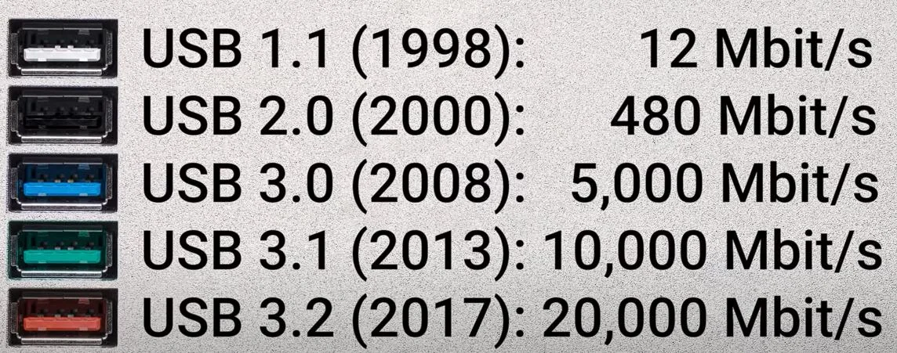

#### USB Connector Types

  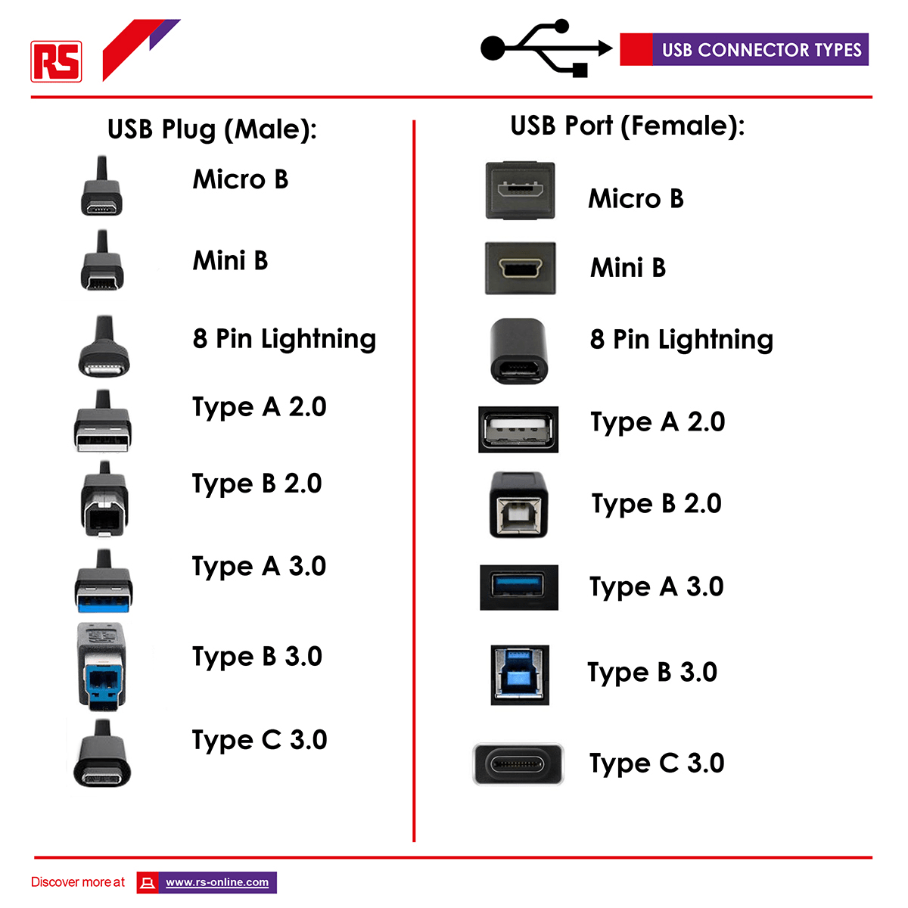

- **Type-A**
  - Standard rectangular USB ports on most PCs and USB cables
- **Type-B**
  - Near-square connector
  - Used for large-sized peripherals like <mark>printers</mark>
- **Mini-B**
  - Smaller connector for devices like smartphones and cameras
  - Less durable and less common now
- **Micro-B**
  - Compact connector for smaller devices
  - Can have 2-part plug or 1-part plug
- **Type-C**
  - Compact, reversible connector
  - Compatible with larger and smaller devices
- **Lightning**
  - Apple's proprietary charging device

### Other Peripheral Ports and Connectors

>Relative speeds:
>
>Thunderbolt > USB > FireWire > eSATA

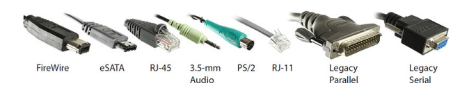

- **Thunderbolt**
  - Primarily used on MACs to connect monitors
  - Supports a variety of peripherals and daisy-chaining up to six devices
  - **Thunderbolt 1**
    - 10 Gbps, uses Mini DisplayPort connector
  - **Thunderbolt 2**
    - 20 Gbps, also uses Mini DisplayPort connector
  - **Thunderbolt 3**
    - 40 Gbps, uses USB 3.1 Type-C connector

- **FireWire (IEEE 1394)**
  - Becoming obsolete
  - Commonly used with digital cameras, media devices, and external hard drives
  - **FireWire 400**
    - 400 Mbps
  - **FireWire 800**
    - 800 Mbps

- **eSATA**
  - Becoming obsolete
  - For external SATA storage devices like external hard drives
  - Not interchangeable with USB or plain SATA
  - Speeds: 1.5, 3, or 6 Gbps

- **RJ-45**
  - Ethernet networking connector
  - Visible metal pins inside
  - Transparent rectangular plastic connector
  - Has a release tab on top

- **RJ-11**
  - Used for traditional <mark>modems</mark> and landline telephones
    - Logic: modem -> telephone lines -> RJ-11
  - Smaller version of RJ-45 connector
  - Less common

- **3.5-mm Audio**
  - Commonly used for microphones, headphones, and speakers
  - Similar to a small headphone jack
  - Often color-coded

- **PS/2**
  - Round plugs for older mice and keyboards with a bunch of pins inside
    - Green for mouse, purple for keyboard
  - Largely replaced by USB

- **Legacy Parallel**
  - Obsolete
    - Mostly replaced by USB
  - For old printers
  - 25-pin D-shaped connector

- **Legacy Serial**
  - Obsolete
  - For various old low-speed devices, e.g. monitors
  - 9-pin D-shaped connector
  - Mostly replaced by USB

## Monitors

- Primary output device
  - Touch screen is an input and output device
- Displays results of input and computer processing
- Back of the monitor has connections for video signal and power
- Adjustment buttons typically located on the monitor's edge
- On-screen menu for settings like brightness, contrast, color balance, size, and position

### Monitor Types

- **Flat-Panel Displays (FPD)**:
  - Thin, lightweight, and low power consumption.
  - Modern FPDs mostly use 16:9 or 16:10 widescreen aspect ratios

  - **Liquid Crystal Display (LCD)**:
    - <mark>Most common type of monitor</mark>
    - Backlit layer of liquid crystal molecules
    - Older models use cold cathode fluorescent lamps (CCFLs)
    - Newer models use light-emitting diode (LED) backlights

  - **Organic Light-Emitting Diode (OLED)**:
    - Used in high-end devices, doesn't need a backlight

  - **Plasma Displays**:
    - Mostly for TVs, can connect to computers
    - Uses phosphorous cells, wider viewing angle, susceptible to burn-in

- **CRT Monitors**
  - Cathode ray tube
  - Bulky due to the large cathode ray tube
  - Used a lot of electricity
  - Uses electron guns to activate screen phosphors
  - Obsolete but might appear in exam questions
  - Contains hazardous materials
    - Requires proper disposal

- **Projectors**
  - Projects image onto a screen
  - Important qualities
    - Brightness (lumens)
    - Throw (image size at a distance)
      - Short-throw projectors create large images from a short distance
  - Projector lamps generate light and heat, have a fan for cooling
    - Expensive to replace
  - Modern projectors support wireless connectivity (Bluetooth, Wi-Fi)

- **Touchscreens**
  - Function as both input and output devices
  - Include a digitizer for touch sensitivity
  - **Resistive**
    - 2 sheets of flexible plastic
      - When pressed, create an electric signal
    - Anything you touch it with creates a signal
  - **Capacitive**
    - Glass surface
    - Uses electric properties of the human body

### Monitor Ports and Connectors

- Video-only connectors:
  - VGA
  - DVI
- Video and audio connectors:
  - HDMI
  - S-Video
  - Thunderbolt
  - DisplayPort
  - Multi-cable
    - Composite
    - Component

- **DVI**
  - Digital Visual Interface
  - Common connector types:
    - DVI-D (digital)
    - DVI-A (analog)
    - DVI-I (integrates digital and analog)
  - Not always digital despite the name
  - Older connector

- **HDMI**
  - High Definition Multimedia Interface
  - Standard for television and increasingly common in monitors
  - Handles both video and audio signals
  - Common connector types:
    - Full-size Type-A
    - Mini Type-C

- **VGA**
  - Video Graphics Array
  - Oldest video connector still in use
  - Analog connector with 15 pins in three rows
    - Doesn't carry any digital signal
  - Use when DVI and HDMI are not available

- **Composite Video**
  - Round yellow RCA connector, often paired with red and white RCA connectors for audio
  - Not ideal for PC use due to lower resolution support

    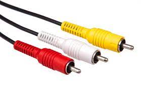  

- **S-Video**
  - Round plug with four pins
  - Better quality than composite video but lower than component video
  - Carries both audio and video signals

    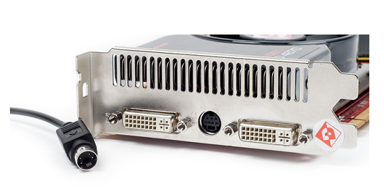

- **Component (RGB) Video**
  - Analog signal with separate channels for video components
  - Uses three RCA cables (red, green, blue)
  - Less common for PC monitors, more typical for TVs

    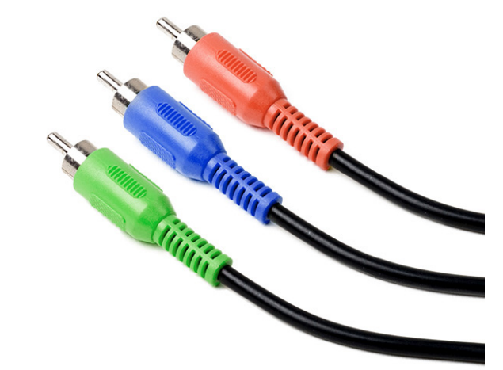

- **DisplayPort, Mini DisplayPort, and Thunderbolt**
  - Primarily found on Macintosh computers
  - Support high-definition video and audio
  - DisplayPort aimed to replace VGA but overshadowed by HDMI
  - <mark>Thunderbolt and Mini DisplayPort are physically identical</mark>

- **USB for Monitors**
  - With an adapter, USB can connect to monitors
  - Often used for projectors

## Standard Input Devices

### Keyboards

- Primary input device for text input and command issuance via shortcuts
- Standard layout: QWERTY
- Connection types
  - USB Type-A
  - PS/2 connector for older keyboards
  - Wireless keyboards use a USB receiver and radio frequency (RF) communication
- Power
  - Wired keyboards are powered by the connection
  - Wireless keyboards require batteries

### Pointing Devices

- Devices like mice, trackballs, touchpads, drawing tablets, and joysticks for screen cursor control
- Standard mouse: Two buttons and a scroll wheel
- Connection types
  - USB Type-A
  - PS/2 connector for older mice

## Other Common I/O Devices

### Audio Devices

- Modern computers have built-in sound controllers on the motherboard
- Older systems required add-on sound cards
- Ports: Commonly three 3.5-mm audio jacks, more complex systems have five or six
  - 3.5-mm audio connectors are common in portable media devices, differing from full-size headphone jacks in home audio equipment
  - Each jack usually has a specific function (input/output), sometimes auto-detected
  - Color-coding scheme for identifying audio jack functions
    - Green: main speakers/headphones
    - Pink: microphone
    - Blue: line in, where you bring sound from an external device
    - Orange: subbuffer
    - Black: rear speakers/surround sound
    - Grey: middle surround sound
  
      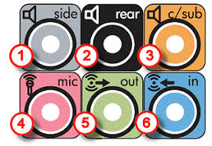

- Bluetooth and Wi-Fi for wireless audio connectivity
  - Bluetooth: Shorter range, no IP address needed
  - Wi-Fi: Longer range, can play audio remotely (e.g., from another country)

### Scanners

- Digitalize paper photos, documents, drawings, etc
- Types: Traditional flatbed, camera-based document, book scanners, sheet-fed document scanners
- Connection: Usually via USB, Bluetooth, or Wi-Fi

### Digital Cameras and Webcams

- Input device
- Dedicated digital cameras/camcorder
  - Offer higher quality and features than smartphones
- Webcams
  - Primarily for video calling/chatting over the Internet, often built into devices or available as USB models

### Printers

- Output device
- Fax machines are often integrated into multifunction printers

- **Impact Printers**
  - <mark>Uses impact/percussion to print</mark>
  - The printhead physically strikes a ribbon to create text/image
  - Noisy and slow
  - Mostly obsolete
    - Except dot-matrix printers

- **Inkjet Printers**
  - Uses liquid ink cartridges
  - Combines ink to make colors
  - <mark>Spray the ink out and heats it up to stick it to the paper</mark>
  - Good for text/image

- **Laser and LED Printers**
  - Relies on organic compounds that conduct electricity when exposed to light
  - Uses toner and light to print
  - Laser Beam creates an image on a drum
  - Toner coats the drum, sticking to the laser-touched areas
  - Toner moves from the drum to paper
  - Heat fuses the toner onto the paper, creating the print
  - Good for text

- **Thermal Printers**
  - <mark>Use heat-sensitive paper or film</mark>
  - Common for receipts

  >Cost considerations include ink/toner, paper, and parts replacement
  > 
  >Inkjet: Cheap printers but expensive cartridges
  > 
  >Laser: Higher initial cost but cheaper per page
  > 
  >Thermal: Cheapest to operate, requires only thermal paper

#### Fax Machines

- Input and output device
- Transmit and receive documents over telephone lines
- Modern fax technology is often part of multifunction printers

### Multifunction Devices (MFDs)

- Combine printer, scanner, copier, and fax machine
- Cost-effective for multiple functionalities
  - Can be complicated to set up though
- Connection types
  - USB
  - Network (wired or wireless)

### Exam Tip

- Be familiar with older printer connection types like FireWire, parallel, and serial for the CompTIA IT Fundamentals exam.
